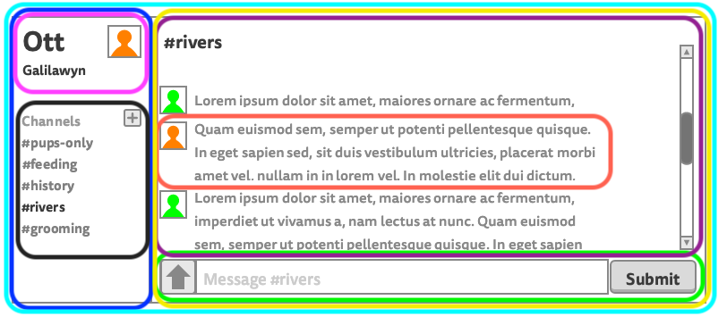

# React: Components and props

## Learning goals

* Contrast imperative and declarative programming
* Describe the purpose of the virtual DOM
* Compare the virtual DOM to the actual DOM
* Explain the benefits or drawbacks of using the tool `create-react-app`
* Create a React app that renders "Hello, World!" to the screen
* Describe the component hierarchy using the terms root, parent, and child

* Create a React app that renders a container, one list, and five list items
* Define the term prop in the context of React
* List the types of data that can be passed as props
* Identify components from a wireframe and draw out the flow of information

## What was hard about vanilla JS?
*

## Objectives

- Take the wireframe from our design team and
  - Identify components
  - Map out the initial component hierarchy
- Create a new React app using `npm init react-app chat`
  - Remove all boilerplate code
  - In [`app`](./chat/src/App.js) component, render "Hello, World!"
  - Import dummy data from [`data.js`](./chat/src/data.js)
  - Create a static app from the wireframe (almost finished)

## Components
-

## Prop flow
